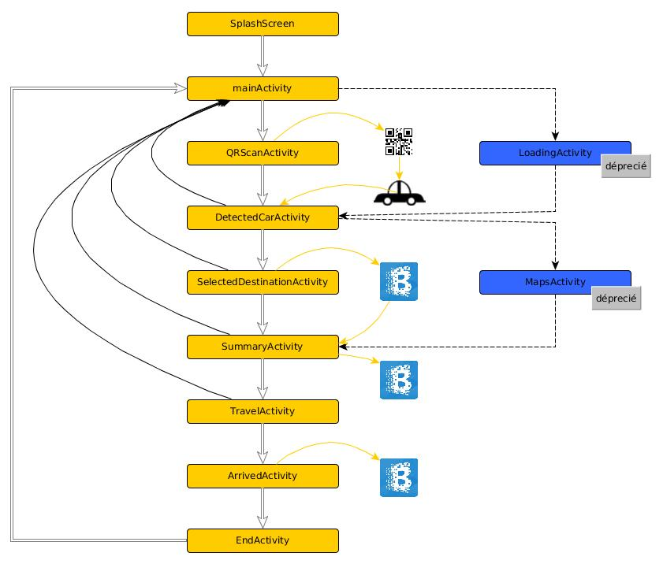

Mobile app for Chupi demo based on Ethereum Blockchain
====================

Application mobile de décentralisation de la location de véhicule par la blockchain.

Testé sur Android 5.1. (Api 22)
Paramètre de configuration pour les SDK : 
> minSdkVersion 21 
> targetSdkVersion 24


# scenario
jim veut louer une voiture pour aller de A vers B.

* étape 1. Scanner pour trouver une voiture au choix de l'utilisateur:
* étape 1.1. via QR code : *apparition d'une fenêtre de scan pour QR code*
* étape 1. 2. via blue touch : *indisponible pour la démo DevFest*
* étape 2. Choix de la voiture
* étape 3. Choix de la destination : choix entre 5 destinations préremplis *apparition d'une carte pour sélectionner l'endroit (désactivé, actuellement : choix préenregistré)*
* étape 4. Payement de la course
* étape 5. Voyage en cours
* étape 6. Validation de la destination
* étape 7. Fin du scenario


```
# Architecture fichiers java:





```
#Important
La génération du QRcode doit être fait sans inclure le "htpp://" et en incluant le numéro de port.
Actuellement, il cherche à la racine, il cherche une image nommée "img.jpg" et un json nommé "toto.json"
